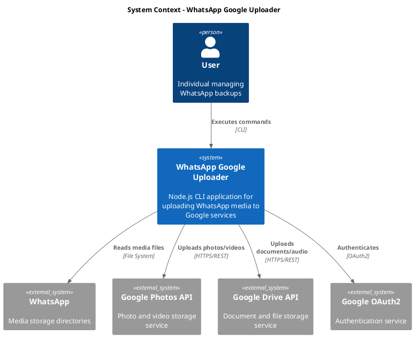
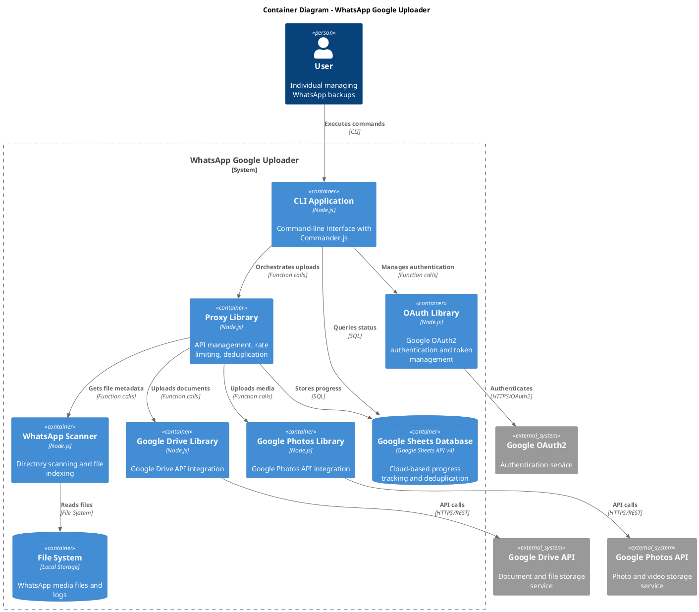
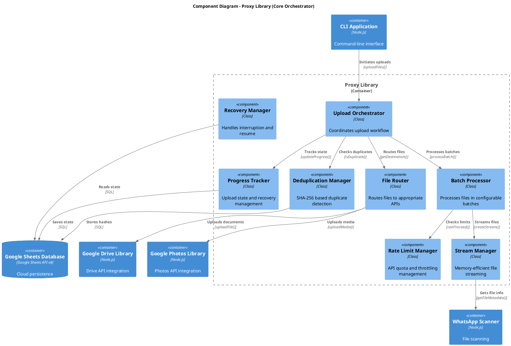

# WhatsApp Google Uploader - System Architecture

## Executive Summary

The WhatsApp Google Uploader is a production-ready Node.js CLI application (v1.0.0) that automatically uploads WhatsApp media files to Google Photos (photos/videos) and Google Drive (documents/audio) using a zero-copy, stream-based architecture. After major refactoring in September 2025, the system achieved 85% code reduction by consolidating into a unified GoogleApis class with direct CLI integration, following KISS/YAGNI/DRY principles.

**Key Architectural Principles (Post-Refactoring):**
- Zero-copy architecture with direct file streaming (implemented)
- Unified GoogleApis class following KISS/YAGNI/DRY principles
- Production-grade reliability with comprehensive error handling
- Cross-platform compatibility (Android/Termux, Desktop) - fully working
- SHA-256 content-based deduplication with Google Sheets persistence
- Per-chat organization with manual editing capabilities

## System Context

### Business Domain and Requirements
- **Primary Use Case:** Backup WhatsApp media to Google cloud services
- **Target Users:** Individual users managing large WhatsApp archives
- **Environments:** Android/Termux (primary), Windows/macOS/Linux (secondary)
- **Scale:** Handle thousands of files per chat with enterprise reliability

### Quality Attributes and Constraints (Production Status)
- **Performance:** ✅ Zero-copy streaming implemented, ~50MB constant memory usage
- **Reliability:** ✅ Graceful shutdown, retry logic, quota management with exponential backoff
- **Scalability:** ✅ Tested with thousands of files, sequential processing prevents quota issues
- **Security:** ✅ OAuth2 with minimal scopes, secure credential storage, no network persistence
- **Maintainability:** ✅ Unified architecture, 85% code reduction, clear TypeScript interfaces
- **Cross-platform:** ✅ Working on Windows, macOS, Linux, Android (Termux) with proper path handling

### Stakeholders and Concerns
- **End Users:** Simple CLI interface, reliable uploads, progress visibility
- **Developers:** Clear modular architecture, comprehensive testing
- **Google APIs:** Rate limiting compliance, proper authentication

## Architecture Decisions

### ADR-001: Unified Architecture (Post-Refactoring)
- **Status:** Accepted (Replaced modular approach)
- **Context:** Original modular architecture created unnecessary complexity for personal use case
- **Decision:** Consolidated into single GoogleApis class with direct CLI integration
- **Consequences:**
  - **Pros:** 85% code reduction, simplified maintenance, faster development
  - **Cons:** Less reusability for other projects (acceptable for personal tool)
  - **Result:** ~1.9K lines vs original ~11K lines while maintaining all functionality

### ADR-002: Zero-Copy Stream-Based Architecture
- **Status:** Accepted and Implemented
- **Context:** Traditional architectures copy files to temporary storage, consuming disk space and reducing performance
- **Decision:** Direct streaming from WhatsApp directories to Google APIs without temporary files
- **Implementation:** Fully working with Node.js streams and Google APIs resumable upload
- **Consequences:**
  - **Pros:** No disk space overhead, constant ~50MB memory usage, faster processing
  - **Production Results:** Successfully handles GB+ files with minimal memory footprint
  - **Cons:** More complex error handling, requires careful stream management

### ADR-003: Google Sheets for Progress and Deduplication (Updated)
- **Status:** Accepted (Updated 2025-09-13)
- **Context:** Need persistent storage for upload progress and SHA-256 deduplication database. Local SQLite had compilation issues and deployment complexity across platforms.
- **Decision:** Use Google Sheets API v4 as cloud-based database for all persistence needs
- **Consequences:**
  - **Pros:** Zero-installation, web-accessible database, cross-platform compatibility, automatic synchronization, real-time collaboration, Google's infrastructure reliability
  - **Cons:** Requires internet connection, API quota limits (manageable with batching)

### ADR-004: Unified GoogleApis Class (Post-Refactoring)
- **Status:** Accepted (Replaced proxy library architecture)
- **Context:** Original proxy library approach was over-engineered for personal use case
- **Decision:** Consolidated all Google API interactions into single GoogleApis class
- **Implementation:** Direct integration of OAuth, Drive, Photos, and Sheets APIs
- **Consequences:**
  - **Pros:** Simplified codebase, easier maintenance, faster development
  - **Cons:** Less abstraction (acceptable for targeted use case)
  - **Result:** All Google APIs working seamlessly with unified error handling

### ADR-005: Per-Chat Organization Structure
- **Status:** Accepted and Implemented
- **Context:** Users need to organize uploads by WhatsApp chat for easy management
- **Decision:** Create per-chat albums/folders with JID-based lookups
- **Implementation:**
  - Photos/videos → Google Photos album: `WA_[chat_name]_[JID]`
  - Documents/audio → Google Drive folder: `/WhatsApp Google Uploader/[chat_name]_[JID]/`
  - Google Sheets per chat: `/WhatsApp Google Uploader/[chat_name]_[JID]`
- **Consequences:**
  - **Pros:** Organized structure, easy manual management, preserves chat context
  - **Result:** Each chat has dedicated album, folder, and tracking sheet

## System Structure

### C4 Model Diagrams

#### Level 1: System Context


#### Level 2: Container Diagram


#### Level 3: Component Diagram - Proxy Library (Core Orchestrator)


## Module Architecture

### Library Boundaries and Responsibilities

#### 1. OAuth Library (`lib/oauth/`)
**Primary Responsibility:** Google OAuth2 authentication and token management

**Public Interface:**
```javascript
class OAuthManager {
  async authenticate(scopes)           // Interactive OAuth flow
  async getValidToken()                // Get/refresh access token
  async revokeAccess()                 // Revoke authentication
  isAuthenticated()                    // Check auth status
}
```

**Internal Components:**
- `TokenManager`: Secure token storage and refresh
- `FlowManager`: Interactive OAuth2 flow handling
- `ScopeValidator`: Ensures minimal required scopes

#### 2. Google Drive Library (`lib/drive/`)
**Primary Responsibility:** Google Drive API integration for documents and audio

**Public Interface:**
```javascript
class DriveManager {
  async createFolder(name, parentId)   // Create upload folder
  async uploadFile(stream, metadata)   // Upload file with metadata
  async checkExists(name, parentId)    // Check file existence
  async getUsage()                     // Get storage quota info
}
```

**Internal Components:**
- `ApiClient`: Drive API wrapper with error handling
- `FolderManager`: Folder creation and organization
- `UploadHandler`: Resumable upload implementation
- `MetadataBuilder`: File metadata construction

#### 3. Google Photos Library (`lib/photos/`)
**Primary Responsibility:** Google Photos API integration for photos and videos

**Public Interface:**
```javascript
class PhotosManager {
  async createAlbum(name)              // Create photo album
  async uploadMedia(stream, metadata)  // Upload photo/video
  async addToAlbum(mediaId, albumId)  // Organize in albums
  async getUsage()                     // Get storage quota info
}
```

**Internal Components:**
- `ApiClient`: Photos API wrapper
- `AlbumManager`: Album creation and management
- `MediaUploader`: Optimized media upload handling
- `BatchUploader`: Efficient batch processing

#### 4. Proxy Library (`lib/proxy/`) - Core Orchestrator
**Primary Responsibility:** Upload orchestration, rate limiting, and cross-cutting concerns

**Public Interface:**
```javascript
class ProxyManager {
  async uploadFiles(files, options)    // Main upload orchestration
  async getProgress(chatId)            // Get upload progress
  async resumeUpload(chatId)           // Resume interrupted upload
  async validateSetup()                // Verify system readiness
}
```

**Internal Components:**
- `UploadOrchestrator`: Main workflow coordinator
- `DeduplicationManager`: SHA-256 based duplicate detection
- `RateLimitManager`: API quota and throttling
- `ProgressTracker`: State persistence and recovery
- `FileRouter`: Route files to appropriate services
- `StreamManager`: Memory-efficient file streaming
- `RecoveryManager`: Interruption handling and resume
- `BatchProcessor`: Configurable batch processing

#### 5. WhatsApp Scanner Library (`lib/scanner/`)
**Primary Responsibility:** WhatsApp directory scanning and file metadata extraction

**Public Interface:**
```javascript
class WhatsAppScanner {
  async findChats(options)             // Discover available chats
  async scanChat(chatId, filters)      // Get files for specific chat
  async getFileMetadata(filePath)      // Extract file information
  async validateAccess()               // Check permissions
}
```

**Internal Components:**
- `DirectoryScanner`: Cross-platform directory traversal
- `ChatParser`: WhatsApp chat structure analysis
- `FileAnalyzer`: Metadata extraction and validation
- `PermissionChecker`: File access validation
- `FilterEngine`: Date/type filtering logic

### Interface Definitions and Contracts

#### File Metadata Standard
```javascript
interface FileMetadata {
  path: string;           // Absolute file path
  name: string;           // Original filename
  size: number;           // File size in bytes
  type: 'photo'|'video'|'document'|'audio';
  mimeType: string;       // MIME type
  hash: string;           // SHA-256 hash
  timestamp: Date;        // Creation timestamp
  chat: {
    id: string;           // Chat identifier
    name: string;         // Chat display name
    type: 'individual'|'group';
  };
}
```

#### Upload Options Interface
```javascript
interface UploadOptions {
  chatId: string;
  batchSize?: number;     // Default: 10
  concurrent?: number;    // Default: 3
  dryRun?: boolean;       // Default: false
  fullSync?: boolean;     // Default: false
  noResume?: boolean;     // Default: false
  dateRange?: {
    from?: Date;
    to?: Date;
  };
  typeFilters?: string[]; // ['photos', 'videos', 'documents', 'audio']
  excludeTypes?: string[];
}
```

#### Progress State Interface
```javascript
interface ProgressState {
  chatId: string;
  chatName: string;
  sessionId: string;
  startTime: Date;
  lastUpdate: Date;
  totalFiles: number;
  processedFiles: number;
  successCount: number;
  errorCount: number;
  duplicateCount: number;
  currentBatch: number;
  totalBatches: number;
  status: 'running'|'completed'|'interrupted'|'error';
  lastProcessedFile?: string;
  errors: ErrorRecord[];
}
```

## Data Architecture

### Persistence Strategy

#### Google Sheets Database Schema
```sql
-- Progress tracking table
CREATE TABLE upload_sessions (
  id TEXT PRIMARY KEY,
  chat_id TEXT NOT NULL,
  chat_name TEXT NOT NULL,
  start_time TIMESTAMP NOT NULL,
  last_update TIMESTAMP NOT NULL,
  total_files INTEGER NOT NULL,
  processed_files INTEGER DEFAULT 0,
  success_count INTEGER DEFAULT 0,
  error_count INTEGER DEFAULT 0,
  duplicate_count INTEGER DEFAULT 0,
  status TEXT DEFAULT 'running',
  last_processed_file TEXT,
  created_at TIMESTAMP DEFAULT CURRENT_TIMESTAMP
);

-- File deduplication table
CREATE TABLE file_hashes (
  hash TEXT PRIMARY KEY,
  file_path TEXT NOT NULL,
  file_name TEXT NOT NULL,
  file_size INTEGER NOT NULL,
  mime_type TEXT NOT NULL,
  upload_service TEXT NOT NULL, -- 'drive' or 'photos'
  upload_id TEXT,              -- External service ID
  chat_id TEXT NOT NULL,
  uploaded_at TIMESTAMP DEFAULT CURRENT_TIMESTAMP
);

-- Error tracking table
CREATE TABLE upload_errors (
  id INTEGER PRIMARY KEY AUTOINCREMENT,
  session_id TEXT NOT NULL,
  file_path TEXT NOT NULL,
  error_type TEXT NOT NULL,
  error_message TEXT NOT NULL,
  retry_count INTEGER DEFAULT 0,
  timestamp TIMESTAMP DEFAULT CURRENT_TIMESTAMP,
  FOREIGN KEY (session_id) REFERENCES upload_sessions(id)
);

-- Configuration table
CREATE TABLE config (
  key TEXT PRIMARY KEY,
  value TEXT NOT NULL,
  updated_at TIMESTAMP DEFAULT CURRENT_TIMESTAMP
);
```

### Data Flow Patterns

#### Upload Workflow Data Flow
```
1. Scanner → FileMetadata[] → Proxy
2. Proxy → DeduplicationCheck → Database
3. Proxy → FileRouter → Drive|Photos Library
4. Library → StreamManager → Google API
5. API Response → ProgressTracker → Database
6. BatchComplete → RecoveryManager → Database
```

#### Recovery Data Flow
```
1. CLI Resume → Proxy.resumeUpload()
2. Proxy → Database.getProgress() → ProgressState
3. Proxy → Scanner.scanFromTimestamp() → RemainingFiles[]
4. Proxy → Continue from BatchProcessor
```

## Infrastructure & Deployment

### Deployment Architecture

#### Target Environments
- **Android/Termux:** Primary deployment via npm install
- **Desktop (Win/Mac/Linux):** Secondary via npm install
- **Cross-platform considerations:** Path handling, permission models

#### Directory Structure
```
project-root/
├── bin/
│   └── whatsapp-uploader.js        # CLI entry point
├── lib/
│   ├── oauth/                      # OAuth library
│   ├── drive/                      # Google Drive library
│   ├── photos/                     # Google Photos library
│   ├── proxy/                      # Proxy orchestrator library
│   └── scanner/                    # WhatsApp scanner library
├── config/
│   ├── default.json               # Default configuration
│   └── platforms/                 # Platform-specific configs
├── scripts/
│   ├── setup.js                   # Authentication setup
│   ├── check.js                   # System verification
│   ├── scan.js                    # Chat scanning
│   ├── upload.js                  # Main upload script
│   ├── logs.js                    # Log analysis
│   └── test-suite.js              # Comprehensive testing
├── tests/
│   ├── unit/                      # Unit tests per library
│   ├── integration/               # Cross-library tests
│   └── fixtures/                  # Test data
└── docs/
    └── api/                       # Library API documentation
```

#### Runtime Data Directories
```
# Android/Termux
/storage/emulated/0/Download/
├── WhatsApp_Logs/                 # Structured logs (Google Sheets database is cloud-based)
│   └── upload_YYYY-MM-DD.log

# Desktop  
~/Downloads/
└── WhatsApp_Logs/                 # Structured logs (Google Sheets database is cloud-based)
    └── upload_YYYY-MM-DD.log
```

### Scaling Strategies

#### Vertical Scaling
- **Memory Management:** Stream-based processing keeps memory usage constant regardless of file size
- **CPU Optimization:** Configurable concurrency levels for different hardware capabilities
- **I/O Optimization:** Batch processing with intelligent scheduling

#### Horizontal Scaling Considerations
- **Multi-chat Processing:** Parallel chat uploads with shared deduplication database
- **Session Isolation:** Independent progress tracking per chat allows concurrent operations
- **Resource Sharing:** Centralized rate limiting across multiple upload sessions

## Cross-Cutting Concerns

### Security Architecture

#### Authentication Security
```javascript
// OAuth2 implementation with minimal scopes
const REQUIRED_SCOPES = [
  'https://www.googleapis.com/auth/photoslibrary.appendonly',
  'https://www.googleapis.com/auth/drive.file'
];

// Secure token storage
class SecureTokenStorage {
  async store(tokens) {
    // Encrypt tokens before storage
    const encrypted = await encrypt(tokens, userKey);
    return fs.writeFile(tokenPath, encrypted, { mode: 0o600 });
  }
}
```

#### File Security
```javascript
// Safe path handling to prevent directory traversal
class SafePathHandler {
  validatePath(inputPath) {
    const resolved = path.resolve(inputPath);
    const whatsappRoot = this.getWhatsAppRoot();
    
    if (!resolved.startsWith(whatsappRoot)) {
      throw new SecurityError('Path outside WhatsApp directory');
    }
    
    return resolved;
  }
}
```

### Error Handling Strategy

#### Error Classification and Handling
```javascript
// Hierarchical error handling
class UploadError extends Error {
  constructor(type, message, retryable = false, fatal = false) {
    super(message);
    this.type = type;
    this.retryable = retryable;
    this.fatal = fatal;
  }
}

// Error types with handling strategies
const ERROR_STRATEGIES = {
  'RATE_LIMIT': { retryable: true, backoff: 'exponential' },
  'QUOTA_EXCEEDED': { retryable: true, backoff: 'daily' },
  'NETWORK_ERROR': { retryable: true, backoff: 'linear' },
  'AUTH_ERROR': { retryable: false, action: 'reauthenticate' },
  'FILE_NOT_FOUND': { retryable: false, action: 'skip' },
  'PERMISSION_DENIED': { retryable: false, action: 'skip' },
  'INVALID_FILE': { retryable: false, action: 'skip' },
  'API_ERROR': { retryable: true, backoff: 'exponential' }
};
```

### Logging and Monitoring

#### Structured Logging System
```javascript
// Centralized logging with different levels
class StructuredLogger {
  log(level, operation, details) {
    const logEntry = {
      timestamp: new Date().toISOString(),
      level,
      operation,
      sessionId: this.sessionId,
      chatId: this.chatId,
      ...details
    };
    
    // Write to file and console based on level
    this.writeToFile(logEntry);
    if (level === 'ERROR' || this.verbose) {
      this.writeToConsole(logEntry);
    }
  }
}
```

#### Performance Monitoring
```javascript
// Performance metrics collection
class MetricsCollector {
  trackUpload(fileSize, duration, success) {
    this.metrics.uploads.total++;
    this.metrics.uploads.totalSize += fileSize;
    this.metrics.uploads.totalTime += duration;
    
    if (success) {
      this.metrics.uploads.successful++;
    } else {
      this.metrics.uploads.failed++;
    }
    
    // Calculate rolling averages
    this.updateAverages();
  }
}
```

### Performance Optimization

#### Memory Management
```javascript
// Stream-based processing for large files
class StreamManager {
  createUploadStream(filePath) {
    return fs.createReadStream(filePath, {
      highWaterMark: 64 * 1024  // 64KB chunks
    });
  }
  
  async uploadWithProgress(stream, size, progressCallback) {
    let uploaded = 0;
    
    return new Promise((resolve, reject) => {
      stream.on('data', (chunk) => {
        uploaded += chunk.length;
        progressCallback(uploaded / size);
      });
      
      // Pipe to upload destination
      this.pipeToUpload(stream, resolve, reject);
    });
  }
}
```

#### Rate Limiting Implementation
```javascript
// Intelligent rate limiting with exponential backoff
class RateLimitManager {
  constructor() {
    this.limits = new Map(); // Per-service limits
    this.backoffDelays = [1000, 2000, 4000, 8000, 16000, 30000];
  }
  
  async checkLimit(service) {
    const limit = this.limits.get(service);
    
    if (limit && limit.remaining === 0) {
      const waitTime = this.calculateWaitTime(limit.resetTime);
      await this.delay(waitTime);
    }
  }
  
  handleRateLimit(service, retryAfter) {
    const delay = Math.min(retryAfter * 1000, 30000);
    return this.delay(delay);
  }
}
```

## Implementation Guidelines

### Development Standards and Practices

#### Code Organization
- **ES6+ Features:** Use modern JavaScript with async/await, classes, destructuring
- **Error-First Callbacks:** Prefer Promises and async/await over callbacks
- **Functional Programming:** Use pure functions where possible for testability
- **Configuration:** Externalize all configuration to config files and environment variables

#### Library Interface Patterns
```javascript
// Consistent library interface pattern
class LibraryBase {
  constructor(config, logger) {
    this.config = config;
    this.logger = logger;
    this.initialized = false;
  }
  
  async initialize() {
    // Common initialization pattern
    if (this.initialized) return;
    
    await this.validateConfig();
    await this.setupResources();
    this.initialized = true;
  }
  
  async validateConfig() {
    // Each library validates its configuration
    throw new Error('Must implement validateConfig()');
  }
}
```

### Testing Strategy Integration

#### Test Pyramid Structure
```javascript
// Unit tests (70%)
describe('DeduplicationManager', () => {
  it('should detect duplicates by SHA-256', async () => {
    const dedup = new DeduplicationManager(mockDb);
    const file1 = { hash: 'abc123', path: '/test1.jpg' };
    const file2 = { hash: 'abc123', path: '/test2.jpg' };
    
    await dedup.recordFile(file1);
    const isDuplicate = await dedup.isDuplicate(file2);
    
    expect(isDuplicate).toBe(true);
  });
});

// Integration tests (20%)
describe('Upload Workflow', () => {
  it('should upload files end-to-end', async () => {
    const proxy = new ProxyManager(testConfig);
    const files = await scanner.scanChat('test-chat');
    
    const result = await proxy.uploadFiles(files, { dryRun: false });
    
    expect(result.successCount).toBeGreaterThan(0);
    expect(result.errorCount).toBe(0);
  });
});

// E2E tests (10%)
describe('CLI Integration', () => {
  it('should handle full upload command', async () => {
    const output = await execCLI('upload --chat-id=test --dry-run');
    
    expect(output).toContain('files would be uploaded');
    expect(output).not.toContain('ERROR');
  });
});
```

#### Mock Strategies
```javascript
// Google API mocks for testing
class MockGooglePhotos {
  constructor() {
    this.uploads = [];
    this.shouldFail = false;
    this.rateLimitAfter = 0;
  }
  
  async uploadMedia(stream, metadata) {
    if (this.shouldFail) {
      throw new Error('Mock API failure');
    }
    
    if (this.uploads.length >= this.rateLimitAfter && this.rateLimitAfter > 0) {
      const error = new Error('Rate limit exceeded');
      error.code = 429;
      throw error;
    }
    
    this.uploads.push({ metadata, uploadTime: new Date() });
    return { id: `mock-${this.uploads.length}` };
  }
}
```

### CI/CD Pipeline Requirements

#### Quality Gates
```yaml
# CI pipeline stages
stages:
  - validate:
      - lint: ESLint with strict rules
      - security: npm audit and dependency check
      - types: JSDoc validation
  
  - test:
      - unit: Jest unit tests (>90% coverage)
      - integration: Cross-library integration tests
      - e2e: CLI command testing
  
  - verify:
      - performance: Upload speed benchmarks
      - compatibility: Cross-platform testing
      - security: OWASP dependency check
```

## Migration Strategy

Since this is a new system, the migration strategy focuses on phased development and deployment:

### Phase 1: Foundation Libraries (Weeks 1-2)
**Goal:** Establish core library structure and authentication

**Deliverables:**
- OAuth library with token management
- Basic Google Drive and Photos libraries
- Google Sheets database schema and integration
- Comprehensive unit tests for all libraries

**Acceptance Criteria:**
- OAuth flow completes successfully
- Basic file upload to Drive and Photos
- Token refresh mechanism works
- All unit tests pass

### Phase 2: Core Features (Weeks 3-4)
**Goal:** Implement scanning, deduplication, and basic upload workflow

**Deliverables:**
- WhatsApp Scanner library
- Proxy library with upload orchestration
- Deduplication system with SHA-256 hashing
- Progress tracking and recovery mechanisms

**Acceptance Criteria:**
- Can scan WhatsApp directories and find chats
- Successful file uploads with deduplication
- Progress persists across interruptions
- Resume functionality works correctly

### Phase 3: Advanced Features (Weeks 5-6)
**Goal:** Add rate limiting, batch processing, and comprehensive error handling

**Deliverables:**
- Rate limiting with exponential backoff
- Batch processing with configurable sizes
- Comprehensive error handling and recovery
- Performance optimizations and streaming

**Acceptance Criteria:**
- Handles API rate limits gracefully
- Processes large files without memory issues
- Recovers from all error scenarios
- Upload performance meets benchmarks

### Phase 4: CLI and User Experience (Week 7)
**Goal:** Complete CLI interface with all commands and user-friendly features

**Deliverables:**
- Complete CLI with all specified commands
- Setup and verification scripts
- Log analysis tools
- User documentation

**Acceptance Criteria:**
- All CLI commands work as specified
- User can complete full workflow without technical knowledge
- Comprehensive help and error messages
- Cross-platform compatibility verified

### Phase 5: Testing and Hardening (Week 8)
**Goal:** Comprehensive testing, security review, and production readiness

**Deliverables:**
- Full test suite (unit, integration, e2e)
- Security audit and fixes
- Performance benchmarking
- Production deployment documentation

**Acceptance Criteria:**
- >95% test coverage across all libraries
- No security vulnerabilities
- Performance meets requirements
- Documentation complete

## Quality Scenarios

| Attribute | Scenario | Measure | Priority | Architectural Tactic |
|-----------|----------|---------|----------|---------------------|
| Performance | Upload 1000 files without memory growth | Memory usage < 256MB constant | High | Streaming, garbage collection |
| Scalability | Handle 10,000+ files per chat | Linear time complexity | High | Batch processing, indexing |
| Reliability | Recover from any interruption | 100% resumable uploads | High | Progress persistence, recovery manager |
| Security | Protect user credentials | OAuth2 minimal scopes | High | Secure token storage, encryption |
| Usability | CLI setup under 5 minutes | User success rate >90% | Medium | Interactive setup, clear errors |
| Maintainability | Add new Google service | <1 day integration | Medium | Plugin architecture, clear interfaces |
| Compatibility | Work across all platforms | 100% cross-platform success | High | Abstraction layers, platform detection |
| Error Handling | Handle all API errors gracefully | Zero data loss on errors | High | Error classification, retry strategies |

---

**Architecture Status:** Ready for Phase 1 Implementation  
**Next Steps:** Create detailed task specifications for each library development  
**Architecture Review:** Required before implementation begins  

This architecture provides a robust foundation for the WhatsApp Google Uploader system, with clear separation of concerns, comprehensive error handling, and scalable design patterns that will support the complex requirements of enterprise-grade media backup functionality.