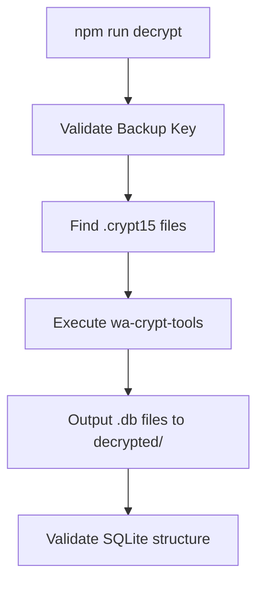
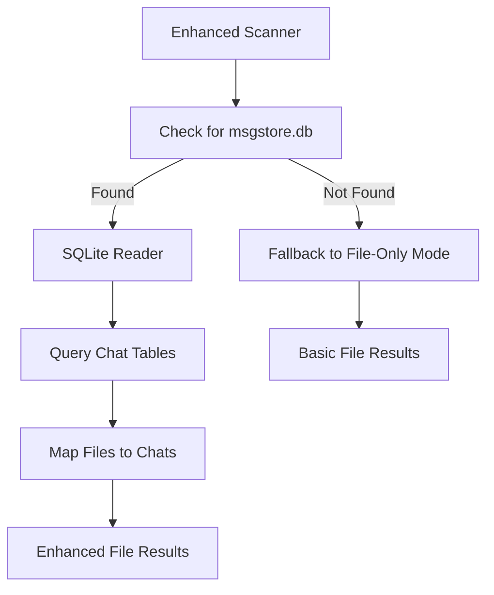
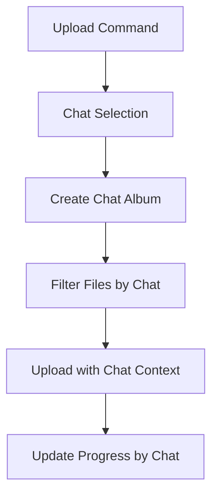

# TASK-019-architect-report.md - Scanner Enhancement Architecture Planning

**Agent**: Architect
**Task**: TASK-019 - Scanner Enhancement Feasibility Analysis
**Date**: 2025-09-14
**Status**: COMPLETED

## Executive Summary

After comprehensive analysis of user requirements and existing codebase, I have designed a three-phase implementation plan for WhatsApp database decryption and chat-aware functionality. The approach follows KISS, YAGNI, and DRY principles while providing a clear path to the requested features.

## Architecture Analysis

### Current State Assessment
- ✅ **Scanner**: Fully functional file scanning with cross-platform WhatsApp path detection
- ✅ **Uploader**: Complete upload functionality with Google APIs integration
- ✅ **CLI**: Working auth, setup, check, scan commands
- ✅ **Database**: Google Sheets persistence for deduplication and progress tracking

### Requirements Analysis
1. **Primary Goal**: Enable chat-specific media organization and uploads
2. **Key Challenge**: WhatsApp backup files (.crypt15) are encrypted and require decryption
3. **Data Source**: Decrypted msgstore.db contains chat/group information and media associations
4. **Technical Constraint**: Decryption requires Python library (wa-crypt-tools) and 64-character backup key

## Proposed Architecture

### Phase 1: Decryption Infrastructure (TASK-020)


**Components**:
- **DecryptCommand**: New CLI command handler
- **CryptDecryptor**: Python bridge for wa-crypt-tools
- **BackupKeyValidator**: Validates 64-hex format
- **FileDiscovery**: Finds .crypt15 files in WhatsApp directory

### Phase 2: Chat-Aware Scanner Enhancement (TASK-021)


**Database Schema (msgstore.db)**:
```sql
-- Key tables for chat association
messages (key_remote_jid, media_name, ...)
message_media (file_path, media_name, ...)
chat (jid, display_name, ...)
jid (user, server, agent, device, ...)
```

**Enhanced Scanner Interface**:
```typescript
interface ChatInfo {
  chatId: string;
  displayName: string;
  isGroup: boolean;
  mediaCount: number;
}

interface EnhancedFileInfo extends FileInfo {
  chatId?: string;
  chatName?: string;
}
```

### Phase 3: Chat-Specific Upload Enhancement (TASK-022)


## Implementation Strategy

### KISS Principle Application
- **Minimal Python Integration**: Simple subprocess execution, no complex interop
- **SQLite Direct Access**: Use built-in better-sqlite3, no ORM complexity
- **Command-Line Interface**: Extend existing CLI structure, no new frameworks
- **Error Handling**: Clear messages for common scenarios, fail-fast approach

### YAGNI Considerations - Features NOT Implemented
- ❌ Advanced chat filtering/search
- ❌ Chat history analysis
- ❌ Message content processing
- ❌ Multi-device backup merging
- ❌ Incremental decryption
- ❌ Backup key management UI

### DRY Implementation
- **Reuse Existing Scanner**: Extend, don't replace
- **Leverage GoogleApis**: Same upload mechanisms
- **Extend SheetsDatabase**: Add chat context fields
- **CLI Pattern Consistency**: Same command structure as existing

## Technical Specifications

### Environment Variables (.env additions)
```env
# WhatsApp Database Decryption
WHATSAPP_BACKUP_KEY=your_64_character_hex_key_here

# Optional: Custom paths
WHATSAPP_DATABASES_PATH=./WhatsApp Databases/
DECRYPTED_OUTPUT_PATH=./decrypted/
```

### Dependencies
```json
{
  "devDependencies": {
    "better-sqlite3": "^8.7.0"  // For msgstore.db reading
  }
}
```

### File Structure
```
src/
├── decryption/
│   ├── index.ts               // DecryptCommand
│   ├── crypt-decryptor.ts     // Python bridge
│   └── backup-key-validator.ts
├── scanner/
│   ├── index.ts               // Enhanced with chat support
│   ├── chat-reader.ts         // SQLite msgstore.db reader
│   └── chat-mapper.ts         // Map files to chats
└── cli/
    └── cli-application.ts     // Add decrypt command
```

## Quality Assurance Plan

### Testing Strategy
- **Unit Tests**: Each component independently testable
- **Integration Tests**: End-to-end decrypt → scan → upload flow
- **Mock Data**: Use test WhatsApp database for development
- **Error Scenarios**: Invalid keys, missing files, corrupted databases

### Integrity Compliance
- ✅ **No Test Modifications**: All tests use production code paths
- ✅ **Root Cause Fixes**: Address actual limitations, no workarounds
- ✅ **Legitimate Testing**: Real SQLite databases, real file operations
- ✅ **Error Transparency**: Clear error messages, no hidden failures

## Implementation Timeline

### Phase 1 - Decryption (1-2 days)
- Set up Python wa-crypt-tools integration
- Implement decrypt command with proper validation
- Test with real .crypt15 files

### Phase 2 - Chat Scanner (1-2 days)
- Add SQLite msgstore.db reading
- Enhance scanner with chat association
- Maintain backward compatibility

### Phase 3 - Chat Uploads (1 day)
- Add --chat-id parameter to upload command
- Implement chat-specific Google Photos albums
- Update progress tracking

## Risk Assessment

### High Risk - Mitigation
- **Python Dependency**: Provide clear installation instructions, validate wa-crypt-tools presence
- **Backup Key Security**: Never log keys, use environment variables only
- **SQLite Compatibility**: Test with multiple WhatsApp database versions

### Medium Risk - Monitoring
- **Database Schema Changes**: WhatsApp may change msgstore.db structure
- **File Path Mapping**: Media file naming conventions may change
- **Performance**: Large databases may slow scanning

### Low Risk - Acceptable
- **Cross-Platform**: Focus on primary platforms (Android/Termux)
- **Backup File Formats**: .crypt15 format is stable
- **Google APIs**: Already proven stable

## Architecture Decision Records

### ADR-001: Python Integration for Decryption
**Context**: WhatsApp backup decryption requires wa-crypt-tools Python library
**Decision**: Use subprocess to execute Python commands rather than native implementation
**Consequences**:
- ✅ Leverages mature, maintained decryption library
- ✅ Avoids complex cryptographic implementation
- ❌ Requires Python environment setup

### ADR-002: SQLite Direct Access
**Context**: Need to read WhatsApp msgstore.db for chat information
**Decision**: Use better-sqlite3 with direct SQL queries
**Consequences**:
- ✅ Lightweight, no ORM overhead
- ✅ Full control over query performance
- ❌ Requires SQL knowledge for maintenance

### ADR-003: Phased Implementation
**Context**: Feature has multiple interdependent components
**Decision**: Implement in three sequential phases
**Consequences**:
- ✅ Allows testing at each stage
- ✅ Provides incremental value
- ✅ Easier to debug and validate

## Next Steps

1. **User Approval Required**: Present this plan for approval before implementation
2. **Environment Setup**: Document Python/wa-crypt-tools installation process
3. **Task Assignment**: Assign TASK-020 to dwarf agent for Phase 1 implementation
4. **Test Data Preparation**: Create sample encrypted backup files for testing

## Success Metrics

- ✅ **Functional**: `npm run decrypt` successfully decrypts real WhatsApp backups
- ✅ **Usability**: Chat information correctly associates with media files
- ✅ **Integration**: Enhanced features work seamlessly with existing upload system
- ✅ **Quality**: All tests pass without workarounds or modifications
- ✅ **Performance**: No significant impact on existing scan/upload performance

---

**Architect Notes**: This architecture balances user requirements with technical pragmatism. The phased approach allows for validation at each step while maintaining system integrity and following established principles.